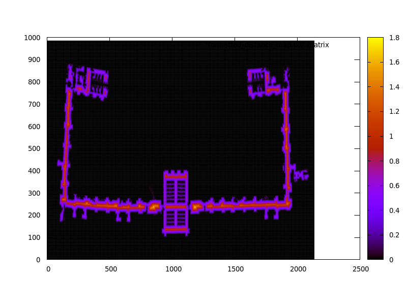
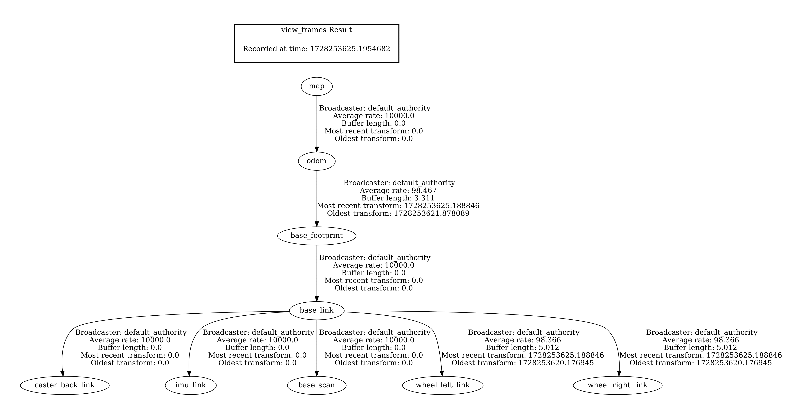

# Robot Programming Final Project

This is the implementation of the final project for the **Robot Programming 2023/2024** course at **Sapienza University of Rome**. The project is developed using **ROS 2 Humble** and **C++** on **Ubuntu 22.04**.

## Table of Contents

- [Robot Programming Final Project](#robot-programming-final-project)
  - [Table of Contents](#table-of-contents)
  - [Overview](#overview)
  - [Features](#features)
  - [Installation](#installation)
    - [Prerequisites](#prerequisites)
  - [Usage](#usage)
  - [Visualization](#visualization)
    - [RViz Simulation](#rviz-simulation)
    - [Distance Map](#distance-map)
    - [TF Tree](#tf-tree)
  
## Overview

In this project I have implemented a Distance Map based localizer uisng the ICP algorithm. In order to test the localizer I have cloned and modified the **Turtlebot3 fake node** form the **turtlebot3_simulations (ros2-devel branch)** ROS package.

## Features

- Added a simple 360° laser scanner to the turtlebot3 fake node
- Modified the turtlebot3 fake node velocity command callback to support collisions with the obstacles.
- The **dmap_lacalization** package contains an executable called **dmap_localization_node** and carries the localization task.
- The **dmap_localization_node** subscribes to */map*, */odom*, */scan*, and */initialpose* topics.
- The localization node constructs a distance map when it receives a grid map from the */map* topic. Then the node waits until it receives an initial pose fron the */initialpose* topic. Then the localization process starts by listening to the */scan* and */odom* topics.
- The localization node publishes the estimated *map -> odom* transformation using *TransformBroadcaster*. It also publishes the estimated pose of the robot on the */localization_pose* topic for visualization purposes.

## Installation

### Prerequisites

- ROS 2 Humble
- C++ compiler
- Following ROS packages:
  - turtlebot3
  - turtlebot3_msgs
  - navigation2

## Usage

1. Clone the repository:

    ```bash
    git clone git@github.com:mosix11/Robot-Programming-Final-Project.git
    ```

2. Install dependencies:

    ```bash
    sudo apt install ros2-humble-turtlebot3* ros2-humble-navigation2
    ```

3. Source ROS Humble:

    ```bash
    source /opt/ros/humble/setup.bash
    ```

4. Build the project:

    ```bash
    cd Robot-Programming-Final-Project/
    colcon build
    ```

5. Set up the environment by the following commands (you have to do this in 2 seperate terminal instances):

    ```bash
    source install/setup.bash
    export TURTLEBOT3_MODEL=burger
    ```

6. Run the localizer node:

    ```bash
    ros2 run dmap_localization dmap_localization_node
    ```

7. Run the simulation node in another terminal instance:

    ```bash
    ros2 launch launch/program_launch.py
    ```

8. Add the */localization_pose* topic to the rviz simulation window. Then publish a pose using 2D Pose Estimate.
9. Run the *teleoperation* node from **turtlebot3** using the following command:

    ```bash
    ros2 run turtlebot3_teleop teleop_keyboard
    ```

10. Start driving the robot!

## Visualization

### RViz Simulation
<p align="center">
  
  <br>
  <em>The big red arrow represents the estimated pose by the localizer.</em>
</p>

### Distance Map
<p align="center">
  
  <br>
  <em>Distance map generated by Wavefront Propagation algorithm.</em>
</p>

### TF Tree
<p align="center">
  
</p>


